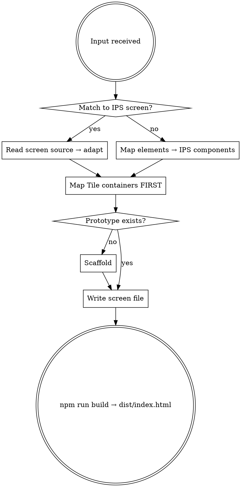

# ProFinda Prototyping

## Overview

Turn descriptions, screenshots, or interaction specs into a running Vite + React prototype that looks exactly like the real ProFinda platform. Uses `@ips/design-system` — all components, tokens and screens are pre-built.

**IPS Design System source (GitHub):**
`https://github.com/pedrorodrigopro/ProFindaComponents` — screens and components reference
`https://raw.githubusercontent.com/pedrorodrigopro/ProFindaComponents/main/` — raw file access

---

## Workflow



---

## Step 1 — Match to IPS Screen First

Check the screens table below. If the requested screen matches, read its source directly from the IPS repo and adapt it — do not rebuild from scratch.

| Screen | Variants |
|---|---|
| **Workflow** | Engagements, Roles |
| **Role** | Overview, Matches, Vacancies, History, Shortlist |
| **Engagement** | Default |
| **Booking Engine** | ProjectsEngagementsGantt, ProjectsRolesGantt, ProjectsEngagementsGrid, ProjectsRolesGrid, WorkforceBookings, WorkforceGrid |
| **Analytics** | Reports, CreateDetails, CreateFields, CreateFilters, CreateGenerate |
| **Audit Planner** | Default |
| **Marketplace** | Home, WorkOpportunities |
| **My Profile** | Default, Narrow (single column) |
| **Profiles Directory** | Cards, TableView, SearchingCards, SearchingTable |
| **Admin — Skills Frameworks** | SkillsFrameworks |
| **Admin — Manage Roles** | DTT, EngagementRoles |

**How to adapt a screen story:**
1. Read the story source file from the IPS repo
2. Copy screen component + all helpers + data
3. Change `../../components/X` imports to `@ips/design-system`
4. Remove `Meta`, `StoryObj`, `export default meta`
5. Add `onBack` / navigation props for screen transitions
6. Wire into `App.tsx`

---

## Step 2 — IPS Components Reference

**All imported from `@ips/design-system`. Never use raw HTML where an IPS component exists.**

### Layout & Shell
| Component | Key props |
|---|---|
| `Navbar` | `activeId` — `"workflow"` `"marketplace"` `"profiles"` `"booking"` `"analytics"` `"admin"` |
| `Page` | `navbar`, `variant="1280"\|"profile-regular"\|"profile-summary"`, `sidebar`, `rightPanel` |
| `Tile` | `tileStyle`, `padding`, `onClick` |
| `Divider` | `orientation="horizontal"\|"vertical"` |
| `Header` | `size="page"\|"section"\|"content"`, `title`, `leftIcon`, `actions` |
| `PageHeader` | `breadcrumbs`, `title`, `wfState`, `subtitleItems` |
| `Accordion` | `title`, `size="body"`, `defaultExpanded` |
| `Navigation` | `orientation`, `tabs`, `activeId`, `onChange`, `fillWidth` |

### Buttons — **Never use raw `<button>`**
| `kind` | Use for |
|---|---|
| `"primary"` | Main CTA |
| `"secondary"` | Secondary action |
| `"destructive"` | Delete / reject |
| `"link"` | Text link — "Show more", "Add Reviewer" |
| `"icon"` | Square bordered icon button — toolbar actions |
| `"iconTertiary"` | Borderless icon button — inline card actions |

### Inputs
| Component | Key props |
|---|---|
| `Input` | `label`, `value`, `onChange`, `placeholder`, `readOnly`, `mandatory`, `state` |
| `InputSelect` | Same as Input + `onClick`, no `onChange` |
| `InputSearch` | `value`, `onChange`, `placeholder` |
| `InputBookingCategory` | `label`, `selectedLabel`, `selectedColor`, `mandatory` |

### Pills & Status
| Component | Notes |
|---|---|
| `PillSimple` | `label`, `size`, `bg`, `color` |
| `PillWFState` | `state: WFState`, `size` |
| `BookingPill` | `category: BookingPillCategory`, `label`, `hours`, `size` |

**WFState values:** `"new"` `"shortlisting"` `"in-review"` `"invited"` `"pending"` `"partially-filled"` `"filled"` `"partially-booked"` `"booked"` `"partially-confirmed"` `"confirmed"` `"not-filled"` `"exceptions"` `"technical-overlay"` `"accreditations"`

**BookingPillCategory values:** `"booking-blue"` `"booking-red"` `"booking-purple"` `"engagement-booked"` `"engagement-partial"` `"role-booked"` `"role-partial"` `"pending"` `"hidden"`

### People
| Component | Key props |
|---|---|
| `Avatar` | `initials`, `size="small"\|"big"` |
| `WorkforceMember` | `variant="small-1line"\|"small-2lines"\|"small-3lines"\|"big"\|"card"`, `name`, `initials`, `email` |

### Cards
| Component | Key props |
|---|---|
| `Card` | `variant="match"\|"directory"`, `name`, `initials`, `matchPercent`, `availabilityPercent`, `skillGroups`, `expandedSkillGroups`, `actions` |

### Data
| Component | Key props |
|---|---|
| `Table` | `columns`, `rows`, `selectable`, `compact`, `sortKey`, `sortDirection`, `onSort` |
| `Checkbox` | `label`, `checked`, `onChange` |
| `Switch` | `label`, `showLabel`, `layout`, `checked`, `onChange` |
| `SliderNumber` | `value`, `onChange`, `min`, `max` |

### Side Panels
| Component | Width |
|---|---|
| `BookingSidePanel` | 400px — `open`, `onClose`, `tab`, `data` |
| `ProfileSidePanel` | 600px |
| `EngagementSidePanel` | 400px |
| `RoleSidePanel` | 400px |
| `BookingCategorySidePanel` | 400px |

---

## Step 3 — Tile Container Hierarchy (do before any JSX)

| `tileStyle` | Background | Use for |
|---|---|---|
| `"highlight"` | `#FFFFFF` white | Primary content cards |
| `"selected"` | `#E7EAF8` blue-tint | Active sidebars, selected panels |
| `"interactive"` | `#FFFFFF` + shadow | Clickable cards (match, profile) |
| `"default"` | `#F8F9FD` neutral | Background grouping, warning blocks |
| `"object-dark"` | `#F8F9FD` + border | Side panel inner blocks |
| `"object-light"` | `#FFFFFF` + border | Side panel inner blocks (white) |
| `"dark"` | `#0C1457` navy | Dark clickable cards |

| `padding` | Value | Use for |
|---|---|---|
| `"panel"` | 8px | Side panels / overlays |
| `"content"` | 16px | Regular content (default) |
| `"screen"` | 24px | Top-level hero tiles |

**Never use a raw `<div>` as a content container — use `Tile`.**
**Never set `style={{ padding }}` on a Tile — use the `padding` prop.**

---

## Step 4 — Design Tokens (from `src/styles/tokens.scss`)

### Key colours
| Token | Hex | Use |
|---|---|---|
| `--palette-primary-0` | `#2358F8` | Primary blue, links, active |
| `--palette-blue-0` | `#0D2976` | Body text, headings |
| `--palette-blue-1` | `#0C1457` | Navbar, dark backgrounds |
| `--palette-blue-2` | `#5C6E9E` | Secondary/muted text |
| `--palette-neutral-0` | `#CFDAF7` | Borders, dividers |
| `--palette-neutral-1` | `#E7EAF8` | Selected backgrounds |
| `--palette-neutral-2` | `#F8F9FD` | Page background |
| `--palette-red-0` | `#D42A36` | Error, destructive |
| `--palette-green-0` | `#248E61` | Success, approved |
| `--palette-orange-1` | `#9B5A01` | Warning text |

### Typography inline shorthand
```tsx
const bodyBold: React.CSSProperties = { fontFamily: "var(--font-family)", fontSize: 14, fontWeight: 700, color: "var(--palette-blue-0)", lineHeight: "115%" };
const body:     React.CSSProperties = { fontFamily: "var(--font-family)", fontSize: 14, fontWeight: 400, color: "var(--palette-blue-0)", lineHeight: "150%" };
const label:    React.CSSProperties = { fontFamily: "var(--font-family)", fontSize: 12, fontWeight: 400, color: "var(--palette-blue-2)", lineHeight: "150%" };
```

### Radii & shadows
| Token | Value |
|---|---|
| `--radius-md` | `8px` |
| `--radius-lg` | `12px` |
| `--tile-shadow-card` | `0px 0px 8px 0px rgba(203,225,242,0.8)` |

---

## Step 5 — Scaffold

**`package.json`**
```json
{
  "name": "profinda-prototype",
  "version": "1.0.0",
  "private": true,
  "type": "module",
  "scripts": { "dev": "vite", "build": "vite build", "preview": "vite preview" },
  "dependencies": {
    "react": "^19.0.0",
    "react-dom": "^19.0.0",
    "@ips/design-system": "file:PATH_TO_IPS_DESIGN_SYSTEM"
  },
  "devDependencies": {
    "@types/react": "^19.0.0",
    "@types/react-dom": "^19.0.0",
    "@vitejs/plugin-react": "^4.0.0",
    "vite-plugin-singlefile": "^2.0.0",
    "typescript": "^5.0.0",
    "vite": "^6.0.0"
  }
}
```

> Replace `PATH_TO_IPS_DESIGN_SYSTEM` with the local path to the IPS Design System repo on this machine.

**`vite.config.ts`**
```ts
import { defineConfig } from "vite";
import react from "@vitejs/plugin-react";
import { viteSingleFile } from "vite-plugin-singlefile";
export default defineConfig({ plugins: [react(), viteSingleFile()] });
```

**`src/main.tsx`** — import order is non-negotiable:
```tsx
import "@ips/design-system/styles/components";
import "./index.css";
import { StrictMode } from "react";
import { createRoot } from "react-dom/client";
import App from "./App";
createRoot(document.getElementById("root")!).render(<StrictMode><App /></StrictMode>);
```

**`index.html`** — must include Mulish:
```html
<!DOCTYPE html>
<html lang="en">
  <head>
    <meta charset="UTF-8" />
    <title>ProFinda Prototype</title>
    <link rel="preconnect" href="https://fonts.googleapis.com" />
    <link rel="preconnect" href="https://fonts.gstatic.com" crossorigin />
    <link href="https://fonts.googleapis.com/css2?family=Mulish:wght@300;400;600;700;800&display=swap" rel="stylesheet" />
  </head>
  <body><div id="root"></div><script type="module" src="/src/main.tsx"></script></body>
</html>
```

---

## Step 6 — Page Shell

```tsx
<div style={{ height: "100vh", display: "flex", overflow: "hidden" }}>
  <Page navbar={<Navbar activeId="workflow" />} variant="1280">
    <div style={{ display: "flex", flexDirection: "column", gap: 16, width: "100%", paddingBottom: 32 }}>
      {/* screen content */}
    </div>
  </Page>
</div>
```

---

## Step 7 — CSS Verification Checklist

- [ ] No `style={{ padding }}` on any Tile — use `padding` prop
- [ ] No raw `<button>` — use IPS `Button` component
- [ ] No raw `<div>` as content container — use `Tile`
- [ ] Icon buttons → `kind="icon"` or `kind="iconTertiary"`
- [ ] Link-style text buttons → `kind="link"`
- [ ] Text uses Mulish — check `index.html` has Google Fonts link
- [ ] `@ips/design-system/styles/components` is the FIRST import in `main.tsx`

---

## Step 8 — Deliver

```bash
npm run build
```

`vite-plugin-singlefile` inlines everything into `dist/index.html` — one portable file.

> "Your prototype is in `dist/index.html` — share it directly or open in any browser."

---

## Common Mistakes

| Mistake | Fix |
|---|---|
| Raw `<button>` | Use `Button` from `@ips/design-system` |
| Icon toolbar buttons | `Button kind="icon"` |
| Borderless inline icon buttons | `Button kind="iconTertiary"` |
| Text/link buttons | `Button kind="link" size="small"` |
| `style={{ padding }}` on Tile | Use `padding="content"` prop |
| `style={{ background }}` on Tile | Use `tileStyle="highlight"` |
| Guessing prop names | Read the IPS story source directly |
| `@ips/design-system/styles/components` not first | Move it to line 1 of `main.tsx` |
| Build produces multiple files | Add `vite-plugin-singlefile` to `vite.config.ts` |
